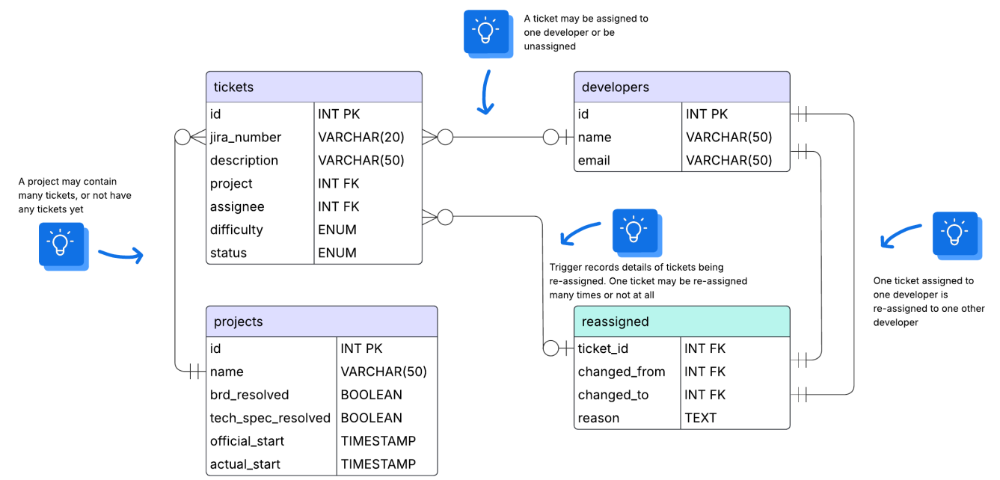

# Design Document

By James Lizamore

Video overview: <URL HERE>

---

## Scope

### Purpose
* This database will be used to keep a record of developer productivity over multiple projects.

### In Scope
* Developers and their contributions to projects.
* Projects, including their start dates.
* Tickets, including what project they are associated with and which developer they are assigned to.
* Re-assigned tickets, including who they were originally assigned to and the reason for re-assignment.

### Out of Scope
* Remote access to the database.
* A user interface or dashboard.
* Getting data directly from JIRA.

---

## Functional Requirements

* A user should be able to perform CRUD operations on all tables.
* Users can utilize a stored procedure to simplify the process of re-assigning tickets.
* The system must track:
  - How many tickets each developer has worked on per project.
  - The difficulty level of each ticket.
  - The progress of each ticket (status: Open, In-progress, Resolved).
  - The history of ticket reassignments.

---

## Representation

### Entities

#### Developers

The `developers` table includes:

* **`id`**  
  - An unsigned integer that uniquely identifies each developer.  
  - This column is the primary key, is auto-incremented, and cannot be null.

* **`name`**  
  - A `VARCHAR(50)` column that stores the developer’s full name.  
  - This column is required (`NOT NULL`).

* **`email`**  
  - A `VARCHAR(50)` column that stores the developer’s email address.  
  - This column is required (`NOT NULL`).

---

#### Projects

The `projects` table includes:

* **`id`**  
  - An unsigned integer that uniquely identifies each project.  
  - This column is the primary key, is auto-incremented, and cannot be null.

* **`name`**  
  - A `VARCHAR(50)` column that holds the name of the project.  
  - This column is required (`NOT NULL`).

* **`brd_resolved`**  
  - A `BOOLEAN` column that indicates whether the Business Requirements Document (BRD) for the project is resolved.

* **`tech_spec_resolved`**  
  - A `BOOLEAN` column that indicates whether the technical specifications for the project are resolved.

* **`official_start`**  
  - A `TIMESTAMP` column that represents the official start time of the project.

* **`actual_start`**  
  - A `TIMESTAMP` column that represents when the project actually began.  
  - *Note:* Developers may actually start on the project before the official start date to boost productivity.

---

#### Tickets

The `tickets` table includes:

* **`id`**  
  - An unsigned integer that uniquely identifies each ticket.  
  - This column is the primary key, is auto-incremented, and cannot be null.

* **`jira_number`**  
  - A `VARCHAR(10)` column that stores the ticket’s JIRA identifier.

* **`description`**  
  - A `VARCHAR(50)` column that holds a brief description of the ticket.

* **`project`**  
  - An unsigned integer that links the ticket to a project.  
  - This column has a foreign key constraint referencing the `id` column in the `projects` table.

* **`assignee`**  
  - An unsigned integer that identifies the developer currently assigned to the ticket.  
  - This column has a foreign key constraint referencing the `id` column in the `developers` table.

* **`difficulty`**  
  - An `ENUM ('1','2','3')` column that indicates the difficulty level of the ticket.  
  - This column is required (`NOT NULL`).

* **`status`**  
  - An `ENUM ('Open', 'In-progress', 'Resolved')` column that represents the current status of the ticket.

---

#### Reassigned

The `reassigned` table includes:

* **`ticket_id`**  
  - An unsigned integer representing the ticket that was re-assigned.  
  - This column has a foreign key constraint referencing the `id` column in the `tickets` table.

* **`changed_from`**  
  - An unsigned integer that stores the ID of the developer from whom the ticket was re-assigned.  
  - This column has a foreign key constraint referencing the `id` column in the `developers` table.

* **`changed_to`**  
  - An unsigned integer that stores the ID of the developer to whom the ticket was re-assigned.  
  - This column has a foreign key constraint referencing the `id` column in the `developers` table.

* **`reason`**  
  - A `TEXT` column that captures the reason behind the re-assignment.

---

### Relationships

As detailed by the diagram:

* One developer can be assigned many tickets (or none at all).
* A project can have many tickets (or none yet).
* A ticket is assigned to one developer and is associated with one project.
* A re-assigned ticket records the developer it was originally assigned to and the developer it is assigned to now, along with the reason for the change.

---

## Optimizations

* **Views:**  
  - The `dev_summary` view aggregates key metrics (e.g., total tickets, status breakdown, and reassignment counts) to give an overview of developer productivity.
  
* **Stored Procedures:**  
  - The `reassign_ticket` stored procedure encapsulates the logic for updating ticket assignments and logging reassignments, ensuring consistency and simplifying operations.
  
* **Indexes:**  
  - Indexes have been added to the `tickets` table on the `assignee`, `project`, and `status` columns to speed up queries.  
    - **`idx_tickets_assignee`** helps with queries filtering by developer.  
    - **`idx_tickets_project`** optimizes lookups by project.  
    - **`idx_tickets_status`** supports queries filtering by ticket status (though note that low-cardinality columns like `status` may not always benefit significantly from indexing).  
  - The design anticipates more reads than writes, which makes these indexes beneficial for performance.

---

## Limitations

* The current schema assumes that each ticket is assigned to only one developer at a time. If a ticket needs to be assigned to multiple developers, the schema will need adjustment.
* The system does not currently support audit logging beyond the basic re-assignment records.
* There is no support for deadlines or priority levels on tickets or projects.
* Future enhancements might include:
  - More detailed audit logging (e.g., tracking changes with timestamps).
  - Adding deadlines, priorities, or additional context for tickets.
  - Enhancing the UI/dashboard for easier data visualization and interaction.

---

