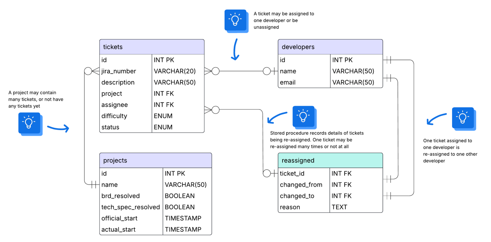

# Design Document

By James Lizamore

Video overview: <URL HERE>

## Scope

### Purpose
* This database will be used to keep record of developer productivity over multiple projects

### In scope:
* Developers and their contribution to projects
* Projects, including their start dates
* Tickets, including what project they are relevant to and to which developer they were assigned
* Re-assigned tickets, including who they were first assigned to and the reason the ticket was re-assigned

### Out of scope:
* Remote access to the database, a UI or dashboard and getting data directly from JIRA 

## Functional Requirements

In this section you should answer the following questions:

* A user should be able to perform CRUD operations on all tables 
* Users can make use of the stored procedure to make re-assigning tickets easier
* Tracking how many tickets each developer worked on for each project, how difficult each ticket is and the progress of each ticket

## Representation

### Entities

The database includes the following entities:

#### Developers

The `developers` table includes:

* **`id`**  
  - An unsigned integer that uniquely identifies each developer.  
  - This column is the primary key, is auto-incremented, and cannot be null.

* **`name`**  
  - A `VARCHAR(50)` column that stores the developer’s full name.  
  - This column is required (`NOT NULL`).

* **`email`**  
  - A `VARCHAR(50)` column that stores the developer’s email address.  
  - This column is required (`NOT NULL`).

#### Projects

The `projects` table includes:

* **`id`**  
  - An unsigned integer that uniquely identifies each project.  
  - This column is the primary key, is auto-incremented, and cannot be null.

* **`name`**  
  - A `VARCHAR(50)` column that holds the name of the project.  
  - This column is required (`NOT NULL`).

* **`brd_resolved`**  
  - A `BOOLEAN` column that indicates whether the Business Requirements Document (BRD) for the project is resolved.

* **`tech_spec_resolved`**  
  - A `BOOLEAN` column that indicates whether the technical specifications for the project are resolved.

* **`official_start`**  
  - A `TIMESTAMP` column that represents the official start time of the project.

* **`actual_start`**  
  - A `TIMESTAMP` column that represents when the project actually began. Developers may actually start on the project before the official start date for productivity's sake

#### Tickets

The `tickets` table includes:

* **`id`**  
  - An unsigned integer that uniquely identifies each ticket.  
  - This column is the primary key, is auto-incremented, and cannot be null.

* **`jira_number`**  
  - A `VARCHAR(10)` column that stores the ticket’s JIRA identifier.

* **`description`**  
  - A `VARCHAR(50)` column that holds a brief description of the ticket.

* **`project`**  
  - An unsigned integer that links the ticket to a project.  
  - This column has a foreign key constraint referencing the `id` column in the `projects` table.

* **`assignee`**  
  - An unsigned integer that identifies the developer currently assigned to the ticket.  
  - This column has a foreign key constraint referencing the `id` column in the `developers` table.

* **`difficulty`**  
  - An `ENUM ('1','2','3')` column that indicates the difficulty level of the ticket.  
  - This column is required (`NOT NULL`).

* **`status`**  
  - An `ENUM ('Open', 'In-progress', 'Resolved')` column that represents the current status of the ticket.

#### Reassigned

The `reassigned` table includes:

* **`ticket_id`**  
  - An unsigned integer representing the ticket that was re-assigned.

* **`changed_from`**  
  - An unsigned integer that stores the ID of the developer from whom the ticket was re-assigned.  
  - This column has a foreign key constraint referencing the `id` column in the `developers` table.

* **`changed_to`**  
  - An unsigned integer that stores the ID of the developer to whom the ticket was re-assigned.  
  - This column has a foreign key constraint referencing the `id` column in the `developers` table.

* **`reason`**  
  - A `TEXT` column that captures the reason behind the re-assignment.

### Relationships

As detailed by the diagram:

* One developer can be assigned many tickets or not yet have any tickets assigned to them.
* A project can have many tickets or not yet contain any tickets.
* A ticket can only be assigned to one developer and a ticket can only be part of one project.
* A re-assigned ticket contains who it was first assigned to and who it assigned to now.

## Optimizations

* Typically, a user would like to see an overview of how tickets, projects and developers relate to one another, hence the creation of the `dev_summary` view.
* Stored procedure for re-assigning tickets is more convenient than manually updating the ticket table and adding record of changes to the `reassigned` table.

## Limitations

* The current schema assumes tickets may only be assigned to one developer at a time. Assigning one ticket to multiple developers may require adjustments in the future
* Software often has many unforeseen complications which may need more context 
* In the future I would like to add audit logging and deadlines for tickets and projects
